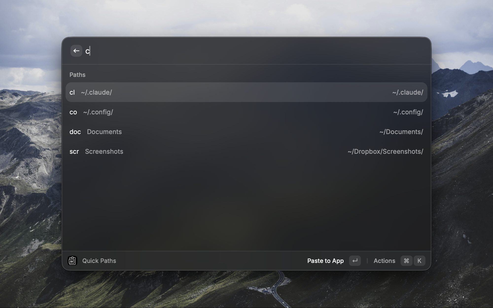
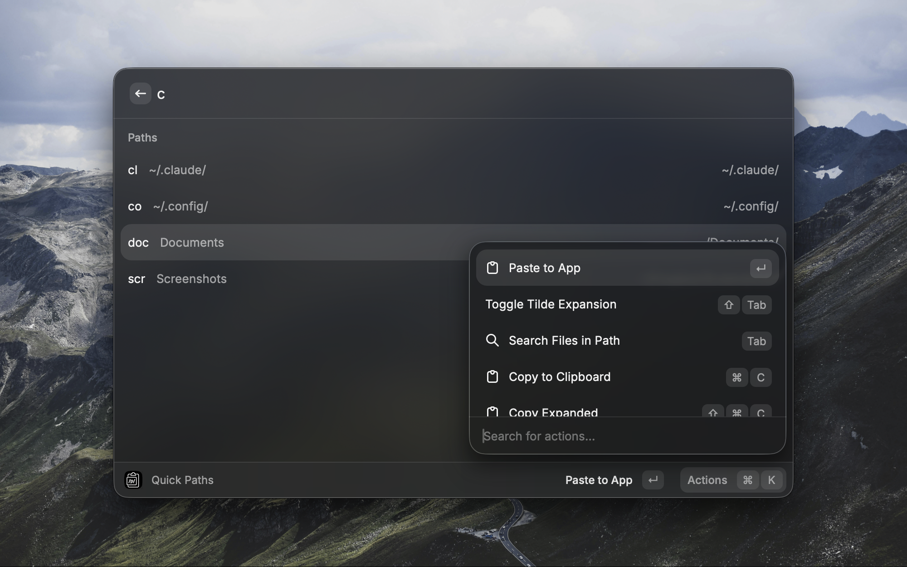

# Quick Paths

A Raycast extension for quickly accessing and inserting your favorite file paths from a searchable catalog.





## Features

- Choose from your predefined list of frequently-used paths
- Insert paths directly into frontmost application or copy to clipboard
- Transition to Search Files with selected path (TAB)
- Expand tilde with one key press (Shift+TAB)
- Edit, add, delete, and reorder paths

## Setup

No setup required — start using immediately!  Optionally configure a CSV/TSV file path in Raycast preferences to use an external catalog.

### Optional: External Catalog File

Create a CSV or TSV file with three columns: `name,description,path`

Example `~/Dropbox/paths.csv`:

```csv
docs,Documentation folder,~/Documents/
drop,Dropbox folder,~/Dropbox/
proj,Projects directory,~/Projects/
conf,Config files,~/.config/
mise,Mise Installs,~/.local/share/mise/installs/
```

Configure the file path in Raycast preferences for this extension.

## Usage

1. Open Raycast and search for "Quick Paths"
2. Add paths using `Cmd+N` or search for existing paths
3. Press Enter to paste into frontmost app
4. Press TAB to transition to Search Files with the selected path
5. Press Shift+TAB to toggle between tilde (`~`) and expanded formats

### Additional Actions

- `Cmd+C` - Copy current format to clipboard
- `Cmd+Shift+C` - Copy alternate format
- `Cmd+E` - Edit selected entry
- `Cmd+Backspace` - Delete entry
- `Cmd+Shift+Up/Down` - Reorder entries

## File Format

The catalog file should contain three columns:

- **name**: Short name for the path (e.g., "docs", "proj")
- **description**: Human-readable description shown in search results
- **path**: File or directory path (use `~` for home directory)

Supports both CSV (comma-separated) and TSV (tab-separated) formats.  Format is auto-detected based on file content.  Quoted values are properly handled.

## License

MIT License - see [LICENSE](LICENSE) file for details.
