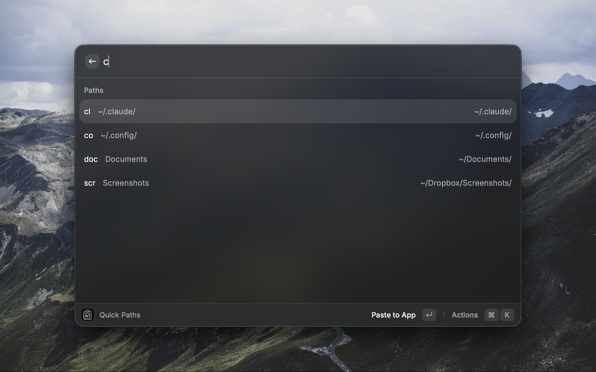
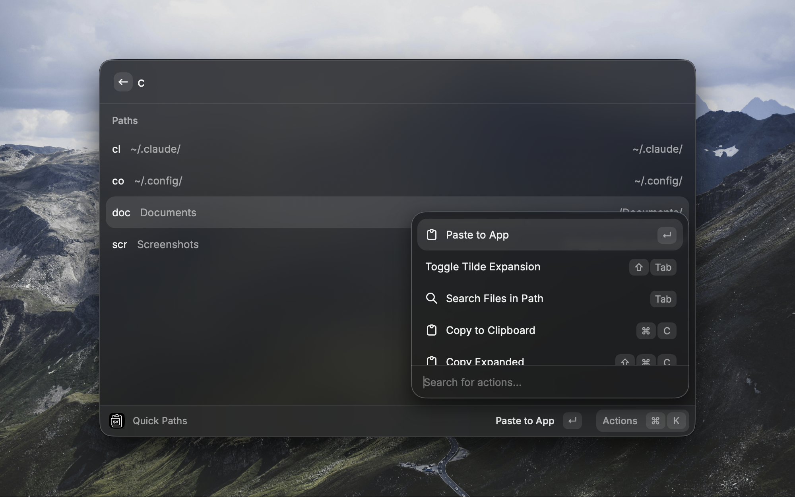

# Quick Paths

A Raycast extension for quickly accessing and inserting your favorite file paths from a searchable catalog.





## Features

- Choose from your predefined list of frequently-used paths
- Search files or paste paths with configurable Enter key behavior (Enter/Shift+Enter)
- Toggle shell path and full path output (TAB)
- Copy to clipboard, edit, add, and delete paths

## Setup

No setup required — start using immediately.  Entries are stored in [qpath](https://github.com/knu/qpath)'s TOML registry under `~/.config/qpath/`.

### qpath Registry

The extension bundles `qpath` and uses its command-line interface as the backend:

```console
qpath add docs ~/Documents/ --desc "Documentation folder" --type d
qpath add proj ~/Projects/ --desc "Projects directory" --type d
qpath ls --type d --format json
```

Only directory entries are shown.

## Usage

1. Open Raycast and search for "Quick Paths"
2. Add paths using `Cmd+N` or search for existing paths
3. Press TAB to toggle paste/copy output between qpath `shell_path` and full `path`
4. Press Enter to search files or paste path (configurable in preferences)
5. Press Shift+Enter for alternate action

### Additional Actions

- `Cmd+C` - Copy current format to clipboard
- `Cmd+Shift+C` - Copy alternate format
- `Cmd+E` - Edit selected entry
- `Cmd+Backspace` - Delete entry

## Backend

`qpath` loads definitions from `~/.config/qpath/paths.toml` and `~/.config/qpath/paths.d/*.toml`.  Add, edit, rename, and delete actions call the bundled `qpath` binary, so comments and formatting in the registry are preserved by qpath.

## License

MIT License - see [LICENSE](LICENSE) file for details.
